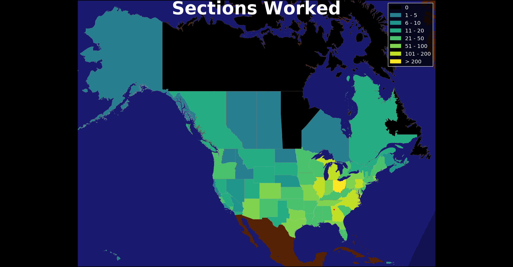
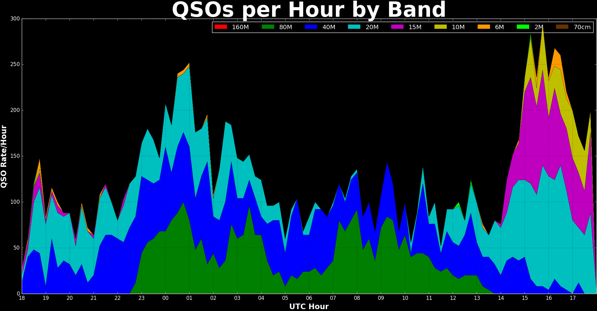
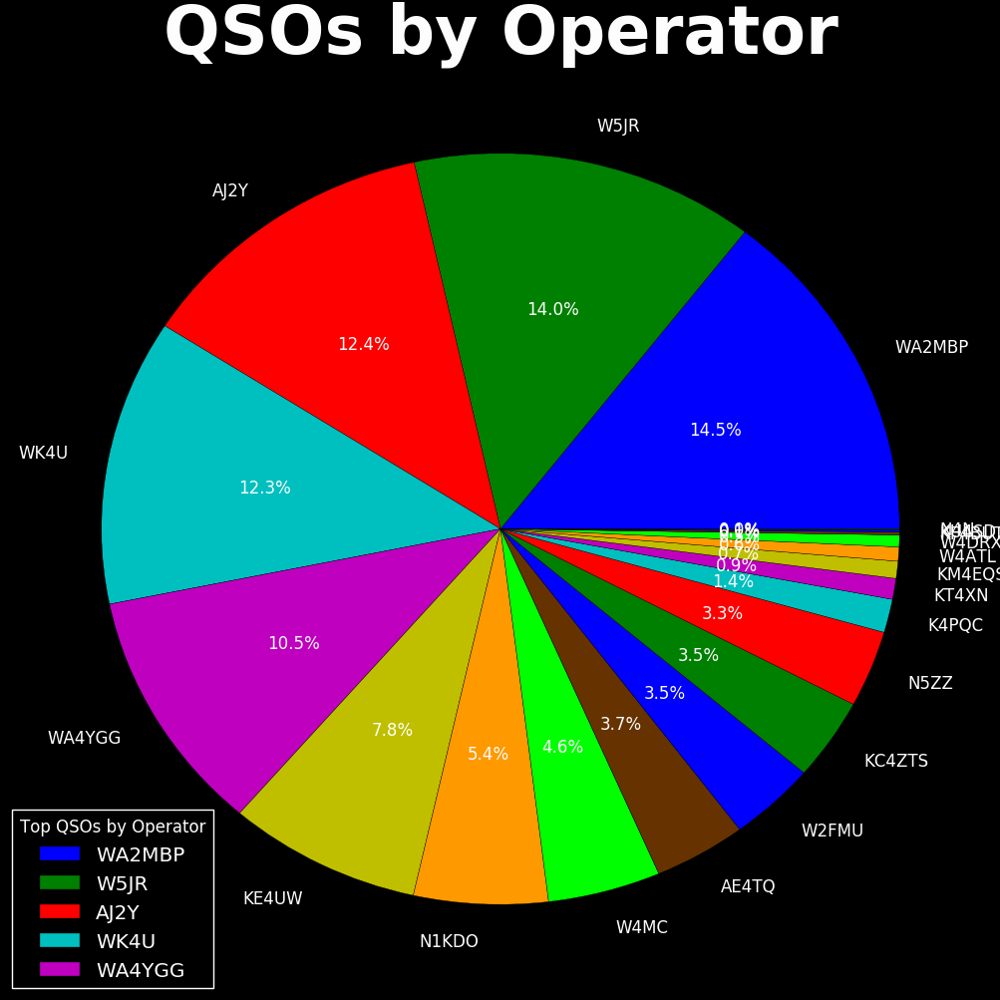
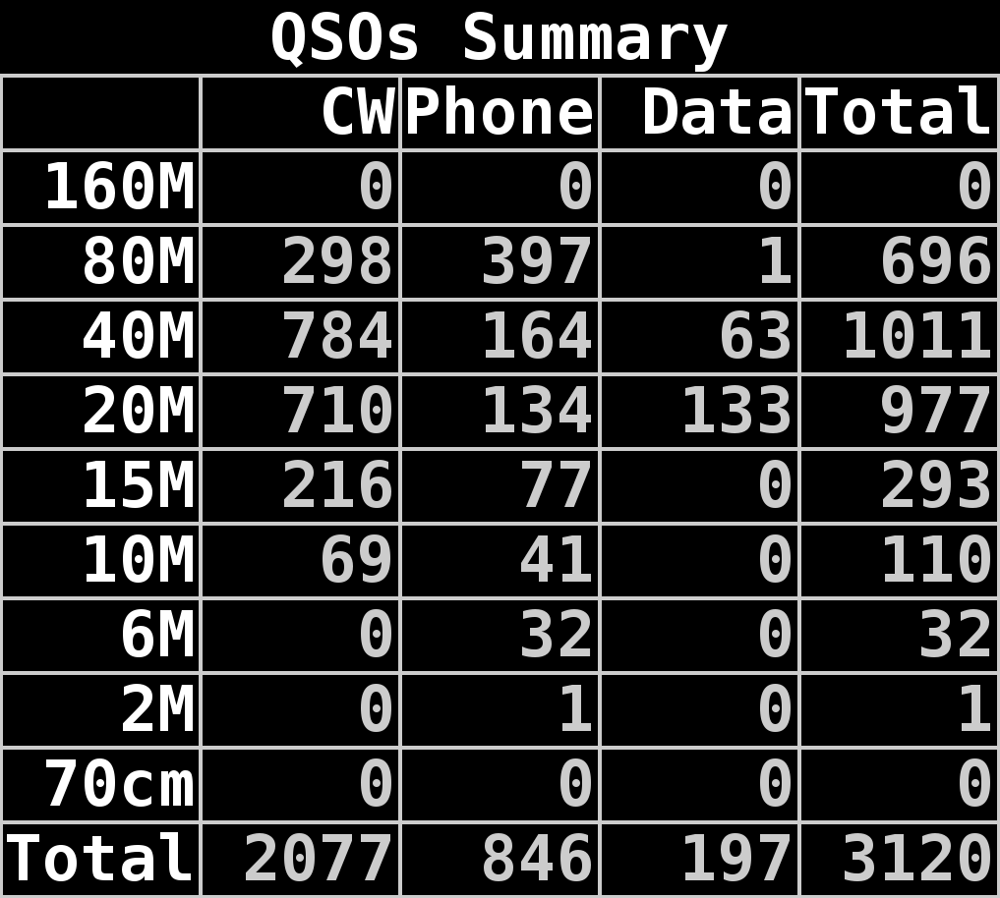

# n1mm_view

`n1mm_view` is a set of python scripts to display real-time contest QSO
 statistics for N4N ARRL Field Day.

It listens to N1MM+ "Contact Info" UDP broadcasts (see the 
[N1MM+ documentation](http://n1mm.hamdocs.com/tiki-index.php?page=UDP+Broadcasts))
and collects the contact info into a database.  The contact info data 
is used to create useful data screens that are continuously rotated.

It was built to run on a Raspberry Pi and to display the statistics 
on a large television screen.  It should run anywhere its dependencies 
can be installed on, meaning it should work on Linux, Windows, and OS X.
It is known to run on the Raspberry Pi and also on Windows 7/10.

Currently, it supports the following displays:

* QSOs by Operator pie chart
* QSO by Band Pie chart
* QSOs by Mode Pie chart
* QSOs by Station Pie chart
* QSOs Summary Table
* QSO/Hour Rate Table
* Top 5 Operators by QSO Count Table
* QSOs/Hour/Band stacked chart
* Sections Worked Choropleth Map, shows all US and Canada sections.

## Example Images:

### QSOs by Section:

### QSO Rate Chart:

### QSOs by Operator Chart:

## Dependencies:

* python 2.7
* python matplotlib library
* python pygame library
* python sqlite3 library

## Components:

* collector.py -- collect contact data from n1mm+ broadcasts
* dashboard.py -- display collected statistics on screen
* n1mm_view_constants.py -- constant values shared by collector and dashboard.  Bands and Modes are defined here.
* n1mm_view_config.py -- configuration data.  in theory, the only part you should need to edit to configure n1mm_view for your environment.
* replayer.py -- test application, "replays" an old N1MM+ log to test collector and dashboard.

## Installation

See [INSTALL_RASPI.md](INSTALL_RASPI.md) for information to install n1mm_view on a Raspberry Pi.

## N1MM+ Setup

N1MM+ needs to be configured to send the UDP messages.  

Use the "Config->Configure Ports, Mode Control..." menu option to open the "Configurer".

From the "Configurer" window, select the "Broadcast Data" tab.  

In the "Broadcast Data" tab, check the box in front of the word "content".  Set the IP address on that same line to be either the single, specific IP of the Raspberry Pi running collector.py, or set it to the proper broadcast address for your subnet. 

(I believe the proper broadcast address can be calculated from the machines's IP address ORed with the NOT of the machine's subnet mask.  I could be wrong.  But for your garden variety 192.168.1.n IP address, the broadcast address is 192.168.1.255.  That's a good place to start from.)

## Usage:

Log in to your raspberry pi.  You don't need X-window system, the dashboard can create the graphics window without X.  Open at least two login sessions.  (Alt-F1, Alt-F2, etc. to switch between virtual consoles if not running X is good.)

Change to the directory where the code is installed.

You may wish to edit the n1mm_view_config.py file to adjust the start and stop dates of field day, for instance.

You may wish to delete the n1mm_view.db database file to reset the counts to zero.  The collector.py program will re-create the database.

In one login session, start the collector:  $ ./collector.py 

THe collector should display output for every QSO message it receives.  This is a good thing.

Control-C will stop the collector.

in the other login session, start the dashboard: $ ./dashboard.py

The dashboard should start up.  Eventually, graphs and tables will be displayed.  The dashboard supports the following keys:

* Q: quit
* left and right arrows: change displayed page
* scroll lock button: stop automatic page changing

## License:

This software is licensed under the terms of the "Simplified BSD license", see [LICENSE](LICENSE).

Copyright 2016, Jeffrey B. Otterson, N1KDO  
All Rights Reserved

## To Do

There's always more to do.  This project is still in late-prototype stage.

* add command-line options
* somebody might want to support other contests besides field day
  * multipliers table
* the `qso_log` table could be exported to ADIF.
